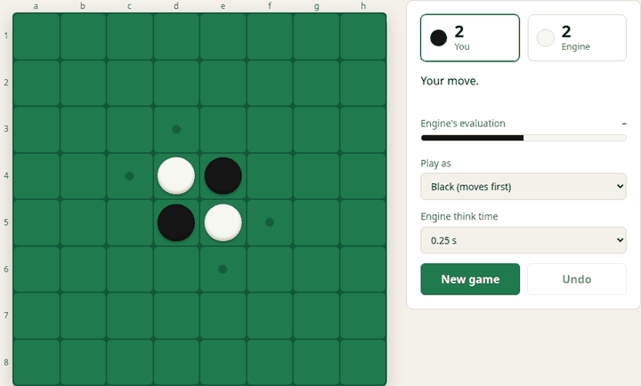
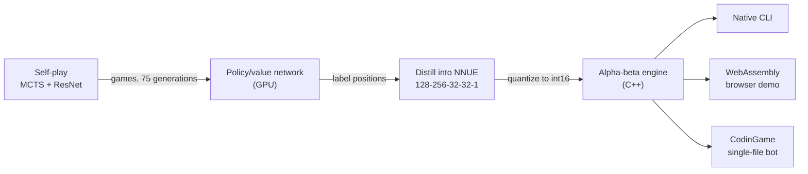

# Othello-Zero

An Othello engine that learned the game from scratch through AlphaZero-style self-play, then
distilled what it learned into a tiny integer neural network fast enough to search with
alpha-beta on a CPU.

**[▶ Play it in your browser](https://haccerkat.github.io/Othello-Zero/)** · Ranked **44 / 644 (top 7%)** on the
[CodinGame Othello leaderboard](https://www.codingame.com/multiplayer/bot-programming/othello-1/leaderboard) (as HaccerKat)



- **No human knowledge.** A 20-block ResNet learned Othello purely from self-play with Monte Carlo
  tree search, gaining over 2900 Elo across 75 generations.
- **Distilled for speed.** Its evaluations were distilled into a 42k-parameter network, quantized to int16
  and searched with alpha-beta in C++. That engine scores 83% against the hand-tuned alpha-beta
  engine it replaced.
- **One engine, three targets.** The same C++ runs natively, in the browser as WebAssembly, and as
  the single-file CodinGame bot, generated from the sources with the weights embedded as text.

## How it works



1. **Self-play** ([training/alphazero](training/alphazero)). A ResNet with 20 bottleneck blocks and policy
   and value heads guides MCTS (100 simulations per move, Dirichlet noise at the root). Each
   generation plays 2048 games, batched across games so GPU inference stays saturated, and trains on
   the results augmented with the 8 board symmetries.
2. **Distillation** ([training/distill](training/distill)). The final network plays games with 800
   simulations per move. Each position is labelled with its MCTS value, and a small MLP learns to
   predict it from a 128-bit board encoding (own discs, opponent discs).
3. **Quantization**. Weights are scaled and rounded to int16, so every layer runs in integer arithmetic.
   A [NumPy reference](tools/nnue_reference.py) reproduces the C++ evaluation to within 1e-7.
4. **Search** ([engine](engine)). Iterative-deepening alpha-beta from depth 1 over a lazily built game
   tree, within a fixed time budget per move. Moves are ordered by the previous iteration's values, and
   leaves at the last ply are evaluated only as alpha-beta needs them. The network's first layer sums
   the weights of occupied squares only, since its inputs are binary. Tests check that the search
   returns the exact minimax value and plays a move it proved best.

## Results

### Elo across generations


Generation 0 is the randomly initialized network and is defined as 0 Elo, though in practice it likely
plays worse than random. Each later generation $x$ plays 512 games against generation $x + 3$ ($x + 1$ for
$x < 6$), and the Elo difference is estimated from the
[Elo formula](https://en.wikipedia.org/wiki/Elo_rating_system) as $400 \log_{10}\left(\frac{1}{E} - 1\right)$,
where $E$ is generation $x$'s expected score. By generation 75, the agent is over 2900 Elo stronger
than generation 0.

### Policy entropy


Average entropy of the policy head during self-play. It drops quickly as the network grows confident
in strong moves; in later generations, search concentrates on the 1 to 3 moves it considers worth
exploring.

### Validation loss


Total, policy and value loss on held-out self-play positions for each generation.

## Building

Requires CMake 3.20+ and a C++20 compiler.

```sh
cmake -S . -B build
cmake --build build
ctest --test-dir build        # perft, NNUE evaluation and search regression tests
```

The engine reads positions from stdin, one per line: 64 squares row by row from a1 (`.` empty,
`0` black, `1` white) followed by the side to move. It prints its move.

```sh
$ echo "...........................10......01...........................0" | build/othello-engine --time 1
d3
```

**Browser demo.** With [Emscripten](https://emscripten.org/) installed:

```sh
emcmake cmake -S . -B build-web
cmake --build build-web           # writes web/engine.js and web/engine.wasm
python3 -m http.server -d web     # then open http://localhost:8000
```

**CodinGame bot.** `python3 codingame/build_bundle.py` writes `build/codingame_bundle.cpp`, a single file
under CodinGame's 100k character limit, ready to paste into the IDE.

## Training

Self-play needs a CUDA GPU. Install the dependencies from `training/requirements.txt`, choosing a CUDA build of
PyTorch.

```sh
cd training/alphazero
python training_loop.py                   # self-play training; checkpoints in models/, plots in plots/
python generate_games.py                  # distillation data from generation 75 into datasets/; runs until stopped

cd ../distill
python train.py                           # trains the NNUE on ../alphazero/datasets
python export_weights.py models_nnue/best.pth   # quantizes into engine/weights
```

The weights in [engine/weights](engine/weights) are from the model submitted to CodinGame, which came from a separate run of
this pipeline.

## Repository layout

| Path | Contents |
| --- | --- |
| [engine](engine) | C++ engine: board, NNUE evaluation, search, CLI and WebAssembly entry points, tests |
| [web](web) | Browser front end, deployed to GitHub Pages |
| [codingame](codingame) | CodinGame referee loop, bundler and a simulated-referee test |
| [training](training) | AlphaZero self-play and NNUE distillation (PyTorch) |
| [tools](tools) | Reference rules, NNUE reference, weight codec, test positions and engine matches |

## References

- [Mastering the game of Go without human knowledge](https://discovery.ucl.ac.uk/id/eprint/10045895/1/agz_unformatted_nature.pdf)
- [OLIVAW: Mastering Othello without Human Knowledge, nor a Fortune](https://arxiv.org/pdf/2103.17228)
- [Lessons From Alpha Zero (part 6): Hyperparameter Tuning](https://medium.com/oracledevs/lessons-from-alpha-zero-part-6-hyperparameter-tuning-b1cfcbe4ca9a)
- [Simple Alpha Zero](https://suragnair.github.io/posts/alphazero.html)

## License

[MIT](LICENSE)
